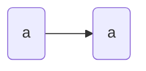

# Welcome to my notes v3
Welcome to my notes. They are very unfinished as I am in the process of moving and uploading them to this new website. 

If something isn't working, raise the issue on the github repository and blame Edward (@EddieTheEd [EddieTheEd](https://github.com/EddieTheEd)). He slanders me on his website, which you should not visit (his website is also a virus). He also unjustly accuses me of defamation. I am not the person who has burnt their house done twice (unlike Edd). These allegations are addressed [[notes/17-03-2023 Allegations|here]].

> [!QUOTE] Facts
>Ed is a bit of a delinquent.
> - MacE, 2023

## Economics
### Chapter Summaries
- These are chapter summaries from the textbook
- [[notes/AEECO - Chapter 1|Chapter 1]]
- [[notes/AEECO - Chapter 2|Chapter 2]]
- [[notes/AEECO - Chapter 3|Chapter 3]]
- [[notes/AEECO - Chapter 4|Chapter 4]]

### Notes
- [[AEECO - Intro|Intro]]
- [[notes/AEECO - Demand and Supply|Demand and Supply]]
- [[notes/AEECO - Elasticity|Elasticity]]
- [[notes/AEECO - Market Efficiency|Market Efficiency]]- In progress

## Computer Science
- In progress

### Programming
- Please note that these notes are incomplete

- [[notes/AECSC - Intro|Intro]]
- [[notes/AECSC - Binary|Binary]]
- [[notes/AECSC - Pseudocode|Pseudocode]]
- [[notes/AECSC - Iterations|Iterations]]
- [[notes/AECSC - Case|Case]]
- [[notes/AECSC - Functions|Functions]]
- [[notes/AECSC - Arrays|Arrays]]

